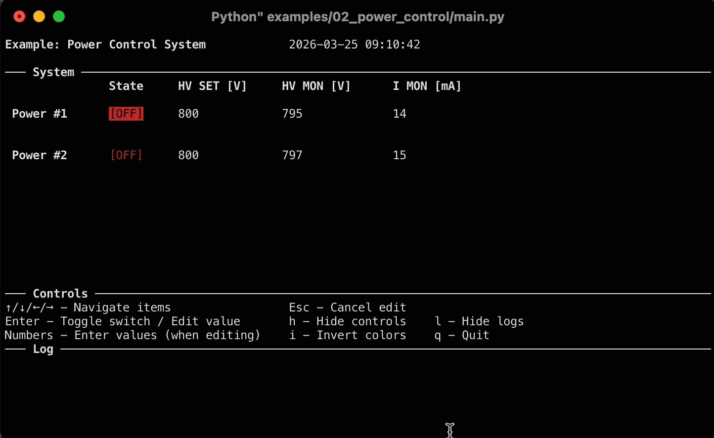

# LabTerm
## About
**LabTerm** is a zero-dependency Python library designed to easily build interactive terminal-based dashboards to interface with laboratory instrumentation, or anything else you wish to monitor and control from a terminal.

The library deals with creating and managing the graphical user interface (using [`curses`](https://docs.python.org/3/howto/curses.html)), leaving you with the sole job of defining what you want to show and how it should behave. 
It's designed to be as modular as possible: if some functionality you need is missing, you can quickly create new types of graphical items with the logic you need.

**When should I use this?**
1. You need some form of real-time graphical interface, but you don't want to bother with LabView or a more complex GUI library like QT, or when you need to access the interface remotely via SSH. 
2. You have a python interface/binding to the instrumentation you need or building one is easy (for example on a Raspberry Pi, using GPIO and I2C).

## Installation
Clone this repository anywhere in your computer by running `git clone https://github.com/mVenez/labterm.git`, then navigate to the repository root directory and install it by running `python -m pip install .`.

## Use
It's easier to understand the library by seeing it in action in the examples provided. What follows is the general scheme to follow when you want to create a dashboard from scratch. Check out the documentation for more information on how to use the different components.

To create your own dashboard you need to:
1. Define one or more subclasses of `Instrument`, which represent the instrument/system you want to interface on. The subclass must contain
    - A `data` dictionary, containing the data values which are monitored/controlled by the instrument.
    - An `update_data()` method, which determines what to do when the dashboard asks the instrument to update its data.
    - An `action()` method which defines how to handle actions requested from the `Dashboard` (for example pressing enter on a dashboard item could do something)
2. In your main script `import labterm`, initialise the `Dashboard` with the settings you prefer and connect it to the instruments.
3. Define and add to the dashboard the various `DashboardItem` you want: these are the items drawn on the dashboard, associated with a measured quantity or a state of a specific instrument, which can take several forms and functions.
